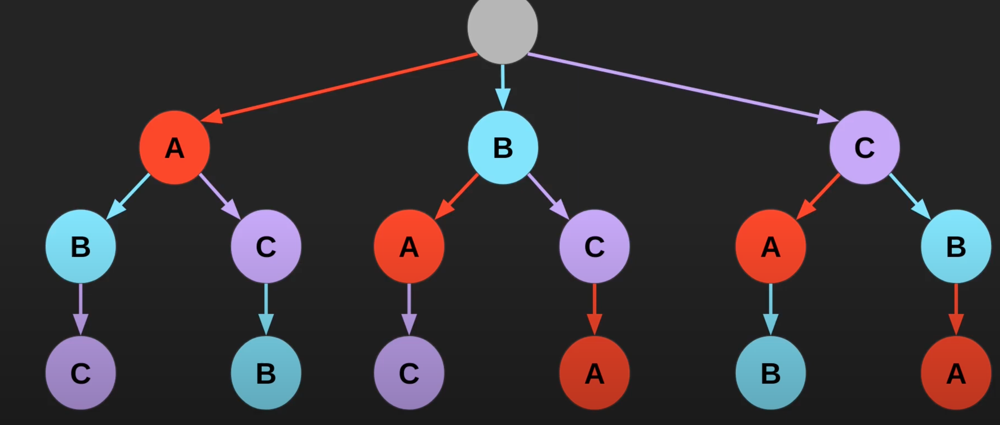

46. Permutation

## 题目

Given a collection of **distinct** integers, return all possible permutations.

**Example:**

**Input:** [1,2,3]
**Output:**
[
[1,2,3],
[1,3,2],
[2,1,3],
[2,3,1],
[3,1,2],
[3,2,1]
]

## 思路

这道题采用递归树的方式去求解。递归树的要点在于如何找到不同的选择，然后基于选择找到所有符合条件的情况。当我们成功画出递归树的时候，发现所有的结果其实都是存在叶节点。由于这道题的状态需要在不同选择的时候进行 backtracking，所以 DFS 遍历是一种常用的手段。

代码如下：

```java
class Solution {
    public List<List<Integer>> permute(int[] nums) {
        List<List<Integer>> ret = new ArrayList<>();
        if (nums == null || nums.length == 0) {
            return ret;
        }
        dfs(nums, new ArrayList<Integer>(), new boolean[nums.length], ret);
        return ret;
    }

    private void dfs(int[] nums, List<Integer> path, boolean[] visited, List<List<Integer>> ret) {
        if (path.size() == nums.length) {
            ret.add(new ArrayList<Integer>(path));
            return;
        }
        for (int i = 0; i < nums.length; i ++) {
            if (visited[i]) {
                continue;
            }
            path.add(nums[i]);
            visited[i] = true;
            dfs(nums, path, visited, ret);
            path.remove(path.size() - 1);
            visited[i] = false;
        }
    }
}
//这个DFS 一共跑了三层。第一次for loop 首先把1加入path, visited, 然后跑第二层。第二层里面因为for loop 首先把2加入path, visited，然后跑第三层。第三层for 只有3.然后第三层拿出3.返回到第二层拿出2，然后第二层跑余下的3，返回到第一层拿出1. 第一层for loop 在跑余下的2，3.
//总结一下，第一层for3次，第二层for 2 次，第三层for 1 次。每次for 都先放进去在拿出来，因为上一层还要用这个数。
```



注意在用 DFS 做 backtracking 的时候一定要注意几点：

1. 合理做 base case
2. 记录不同的状态
3. 状态在 backtracking 的时候记得还原。

这道题的时间复杂度相当于把所有的结果都遍历一遍，所以是 O(N!)。空间复杂度是 O(N)，其中 N 是数组的长度。
